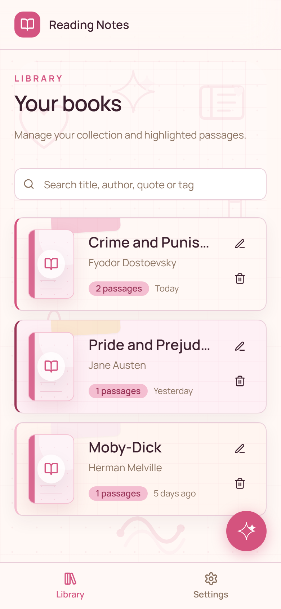
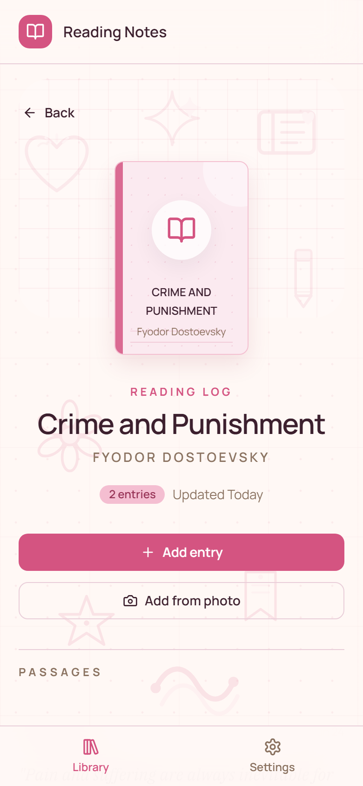
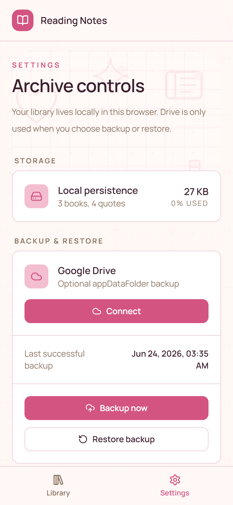

# Reading Notes PWA

Production-ready MVP for a local-first personal reading notes PWA.

The app lets you create books and save quotes, notes, pages and tags under each book. It works without login and stores data locally in IndexedDB. Google Drive is optional and only used for manual backup and restore.

## Live App

Production URL:

```text
https://kitapnot.netlify.app
```

Open this URL on desktop or mobile. No local server or same-Wi-Fi setup is required for normal use.

## Screenshots

<p>
  
  
  
</p>

## Stack

- React
- Vite
- TypeScript
- Tailwind CSS
- shadcn/ui-style local components
- Dexie.js / IndexedDB
- React Router
- vite-plugin-pwa
- Google Identity Services + Google Drive API `appDataFolder`

## Local Development

Install dependencies:

```bash
npm install
```

Start the dev server:

```bash
npm run dev
```

Open on desktop:

```text
http://localhost:5173/
```

## Open On Mobile During Development

For the deployed app, use the production URL above.

Only during local development, keep the dev server running. Vite prints a network URL like:

```text
http://192.168.1.6:5173/
```

On your phone:

1. Connect to the same Wi-Fi as this computer.
2. Open the printed `http://192.168.x.x:5173/` address in the mobile browser.
3. For install-like PWA behavior, use the browser menu and choose Add to Home Screen.

If the phone cannot open it, check Windows Firewall and allow Node.js/Vite on private networks.

## Build

```bash
npm run build
```

Preview the production build:

```bash
npm run preview
```

## Google OAuth Setup

Create a Google OAuth Web client and set:

```env
VITE_GOOGLE_CLIENT_ID=your-client-id.apps.googleusercontent.com
```

Use `.env.local` for local development. Do not commit real secrets.

Authorized JavaScript origins should include:

```text
http://localhost:5173
```

For production, also add your Cloudflare Pages domain.

For the current Netlify deployment, add this authorized JavaScript origin:

```text
https://kitapnot.netlify.app
```

In the same Google Cloud project, enable this API:

```text
Google Drive API
```

If this API is disabled, backup and restore will fail with a 403 `SERVICE_DISABLED` /
`accessNotConfigured` error even when Google sign-in succeeds.

Then add the same client id in Netlify:

```text
Project configuration -> Environment variables -> VITE_GOOGLE_CLIENT_ID
```

Because Vite reads environment variables at build time, redeploy after adding or changing the value.

The app requests only this scope:

```text
https://www.googleapis.com/auth/drive.appdata
```

## Privacy And Public Repo Notes

- The app is static and has no backend database.
- Reading data stays in the browser's IndexedDB unless the user explicitly exports, imports, backs up or restores.
- Google Drive backup uses the hidden `appDataFolder` scope.
- `.env.local`, Netlify state, build output and local generated docs/screenshots are ignored by git.
- `VITE_GOOGLE_CLIENT_ID` is a browser OAuth client id, not a client secret.

## Backup And Restore

Local data is stored in IndexedDB and works offline after the app shell is cached.

Export downloads JSON in this format:

```json
{
  "version": 1,
  "exportedAt": "ISO_DATE",
  "books": [],
  "quotes": [],
  "meta": {}
}
```

Google Drive backup writes one file to the app data folder:

```text
reading-notes-backup.json
```

Restore replaces local IndexedDB data after confirmation.

Known limitation: this is backup/restore only. There is no real-time multi-device sync or conflict resolution engine.

## Photo OCR Capture

Book detail pages include `Add from photo` for mobile quote capture. The browser opens
the camera/photo picker, lets the user crop the quote area and runs OCR locally with
Tesseract.js/WebAssembly.

Current OCR behavior:

- Default language is Turkish.
- Images are processed on-device; they are not sent to a cloud OCR API.
- The cropped image is preprocessed before OCR with upscale, grayscale, contrast,
  adaptive threshold and sharpening.
- The Tesseract worker is cached for the current browser session so repeated captures
  are faster after the first OCR load.
- Extracted text is placed into the normal quote form for review and correction before
  saving.

OCR quality still depends on lighting, focus, page angle, text size and crop accuracy.

## Visual Design

The app uses a rose scrapbook palette, generic patterned book covers and local doodle
SVG assets under `src/assets/doodles/`. The doodle background is decorative,
non-interactive and intentionally low contrast so reading and editing stay primary.

## Netlify Deploy

The project is deployed on Netlify:

```text
https://kitapnot.netlify.app
```

Config file:

```text
netlify.toml
```

Manual production deploy from this machine:

```bash
npm run build
netlify deploy --prod --dir dist
```

## Cloudflare Pages Deploy

Build command:

```bash
npm run build
```

Output directory:

```text
dist
```

Set the production environment variable in Cloudflare Pages:

```text
VITE_GOOGLE_CLIENT_ID
```

Also add the Cloudflare Pages URL to the Google OAuth client's authorized JavaScript origins.
